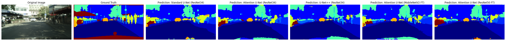

# Comparative Analysis of U-Net Variants for Semantic Segmentation 🚗

  

A comparative study of Standard U-Net, Attention U-Net (SCSE), and U-Net++ for semantic segmentation in urban driving scenes using the Cityscapes dataset. This project also explores the impact of different encoder backbones (ResNet-34, ResNet-50, MobileNetV2) on model performance.

**[➡️ View the Final Report Here 📄](./U-Net_Segmentation_Comparative_Analysis_KondaEtAl_2025.pdf)**

---

## 📖 Table of Contents
- [Project Overview](#-project-overview)
- [Key Features](#-key-features)
- [Limitations & Key Context](#-limitations--key-context)
- [Final Results](#-final-results)
- [Repository Structure](#-repository-structure)
- [Setup and Installation](#-setup-and-installation)
- [Dataset](#-dataset)
- [Usage](#-usage)
- [Acknowledgments](#-acknowledgments)

---

## 🚀 Project Overview

This project investigates the impact of architectural modifications in U-Net's skip connections on semantic segmentation performance for autonomous driving applications. We evaluate and compare three architectures—**Standard U-Net**, **Attention U-Net** (with SCSE attention), and **U-Net++**—on the Cityscapes dataset. The analysis is extended by testing three different encoders (**ResNet-34**, **ResNet-50**, **MobileNetV2**) on the Attention U-Net to understand the trade-offs between model capacity, efficiency, and segmentation accuracy, especially for challenging, occluded classes like "person" and "car".

---

## ✨ Key Features
* **Model Comparison:** Implements and compares Standard U-Net, Attention U-Net (SCSE), and U-Net++.
* **Encoder Analysis:** Evaluates ResNet-34, ResNet-50, and MobileNetV2 as backbones for Attention U-Net.
* **Training Pipeline:** Includes a complete training and fine-tuning pipeline using PyTorch, Adam optimizer, and a `ReduceLROnPlateau` learning rate scheduler.
* **Modular Evaluation:** A flexible evaluation script to measure Mean Intersection over Union (mIoU) for any trained model.
* **Qualitative Visualization:** Generates side-by-side visual comparisons of model predictions against ground truth.

---

## ⚠️ Limitations & Key Context

**A critical factor influencing all results in this project is the image resolution.** To manage computational constraints in a Google Colab environment, all images were downscaled from their original **1024x2048** to **128x256**.

This aggressive downsampling leads to a significant loss of detail, making the segmentation of small objects (like distant pedestrians) and fine boundaries inherently difficult. Therefore, the mIoU scores presented here are **not directly comparable to state-of-the-art benchmarks** but serve as a robust basis for the *relative comparison* between the architectures under these specific, constrained conditions.

---

## 📊 Final Results

U-Net++ with a ResNet-34 encoder achieved the highest overall mIoU and Car IoU, while the Attention U-Net with a lightweight MobileNetV2 encoder surprisingly yielded the best performance on the "person" class.

#### **Quantitative Results (mIoU)**

| Model Configuration                      | Encoder      | Mean IoU (mIoU) | Person IoU | Car IoU    |
| ---------------------------------------- | ------------ | --------------- | ---------- | ---------- |
| Standard U-Net (FT)                      | ResNet-34    | 0.3165          | 0.2180     | 0.6441     |
| Attention U-Net (SCSE) (FT)              | ResNet-34    | 0.3281          | 0.2425     | 0.6984     |
| **U-Net++ (FT)** | **ResNet-34**| **0.3408** | 0.2578     | **0.7235** |
| **Attention U-Net (SCSE) (MobileNetV2 FT)**| MobileNetV2  | 0.3350          | **0.2675** | 0.6989     |
| Attention U-Net (SCSE) (ResNet50 FT)     | ResNet-50    | 0.3378          | 0.2260     | 0.6919     |

#### **Qualitative Results**

*Visual comparison of model predictions. U-Net++ (panel 5) shows the most coherent segmentation for cars, aligning with its high Car IoU.*

---

## 📁 Repository Structure
```
.
├── assets/
│   └── qualitative_results.jpg
├── notebooks/
│   ├── Attention U-Net and Summary - U-Net_Segmentation.ipynb
│   ├── MobileNetV2 - U-Net_Segmentation.ipynb
│   ├── ResNet50 - U-Net_Segmentation.ipynb
│   ├── Standard U-Net - U-Net Segmentation.ipynb
│   └── U-Net++ - U-Net_Segmentation.ipynb
├── .gitignore
├── README.md
├── requirements.txt
└── U-Net_Segmentation_Comparative_Analysis_KondaEtAl_2025.pdf
```

---

## 🛠️ Setup and Installation

This project was developed in a Google Colab environment. To replicate the setup locally:

1.  **Clone the repository:**
    ```bash
    git clone [https://github.com/krishnankonda/unet-semantic-segmentation-cityscapes.git](https://github.com/krishnankonda/unet-semantic-segmentation-cityscapes.git)
    cd unet-semantic-segmentation-cityscapes
    ```

2.  **Create a Python virtual environment:**
    ```bash
    python -m venv venv
    source venv/bin/activate  # On Windows, use `venv\Scripts\activate`
    ```

3.  **Install the required dependencies:**
    ```bash
    pip install -r requirements.txt
    ```

---

## 🏙️ Dataset
This project uses the **Cityscapes** dataset. Due to its large size, the dataset is **not included** in this repository.

1.  **Download:** Please download the required files from the official [Cityscapes website](https://www.cityscapes-dataset.com/):
    * `leftImg8bit_trainvaltest.zip` (Images)
    * `gtFine_trainvaltest.zip` (Fine Annotations)
2.  **Setup:** The notebooks expect the data to be in a folder named `CityScapes` (outside the Git repository) structured as follows:
    ```
    ../
    ├── CityScapes/
    │   ├── leftImg8bit/
    │   └── gtFine/
    └── unet-semantic-segmentation-cityscapes/  <- Your project folder
    ```
    You must update the `root_path` variable in the notebooks to point to your `CityScapes` directory.

---

## 💻 Usage
The project is organized into five Jupyter notebooks located in the `notebooks/` directory. Each notebook is self-contained for training and evaluating a specific model or encoder variation.

* `Standard U-Net - U-Net Segmentation.ipynb`: Trains and evaluates the Standard U-Net.
* `Attention U-Net and Summary - U-Net_Segmentation.ipynb`: Trains, fine-tunes, and evaluates the main Attention U-Net (ResNet-34). This notebook may also contain summary or final evaluation logic.
* `U-Net++ - U-Net_Segmentation.ipynb`: Trains and evaluates the U-Net++.
* `MobileNetV2 - U-Net_Segmentation.ipynb`: Trains and evaluates the Attention U-Net with a MobileNetV2 encoder.
* `ResNet50 - U-Net_Segmentation.ipynb`: Trains and evaluates the Attention U-Net with a ResNet50 encoder.

**Note:** If working in a non-GUI or command-line environment, be aware that filenames containing spaces may require quoting or escaping (e.g., `"notebooks/Attention U-Net and Summary - U-Net_Segmentation.ipynb"`).

---

## 🙏 Acknowledgments
* This project uses the [Cityscapes Dataset](https://www.cityscapes-dataset.com/).
* Models were implemented using the excellent [segmentation-models-pytorch](https://github.com/qubvel-org/segmentation_models.pytorch) library.